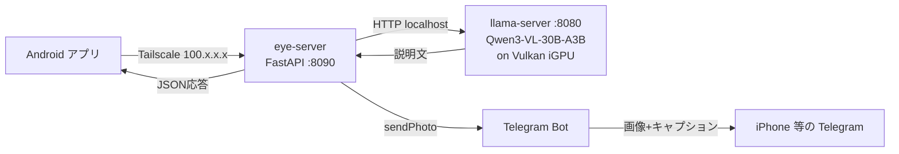

<div align="center">

# Eye

### スマホをLLMの目にするAndroidアプリ + FastAPIプロキシ

[](https://kotlinlang.org/)
[](https://www.python.org/)
[](https://fastapi.tiangolo.com/)
[](https://huggingface.co/unsloth/Qwen3-VL-30B-A3B-Instruct-GGUF)
[](LICENSE)

**外の世界を見たことのないAIに、目の前の風景を語らせる**

---

</div>

## 概要

不要になったAndroidスマホを「LLMの目」として再利用する個人用ツール。
撮影もしくは画像インポート → 自宅PCのVLM (Qwen3-VL-30B-A3B-Instruct on Vulkan iGPU) に送信 →
「外の世界を一度も体験したことのないAI」のロールで【説明】+【コメント】が返る → アプリ画面とTelegramの両方に表示。

## 特徴

| 機能 | 説明 |
|---|---|
| 撮影 / インポート | 標準カメラ起動、もしくはギャラリーから選択 |
| 背景情報入力 | 「ここは水族館」等のヒントをプロンプトに同梱 |
| 縮小/原寸切替 | 高速送信(1280px)と高画質送信(原寸)を選べる |
| 詳細エラー表示 | ネットワーク・サーバ・タイムアウト等を日英併記でコピー可能 |
| Telegramミラー | 結果が画像+キャプションで自動投稿される |
| 椅子ローディング | 送信中の待機画面で 3D モデルがY軸回転 (Animated WebP) |

## アーキテクチャ



## インストール

### 1. PC側 (ミニPC想定)

#### llama-server (Qwen3-VL)

```bash
# Qwen3-VL-30B-A3B-Instruct-Q4_K_M.gguf + mmproj-F16.gguf を取得
# 起動引数:
llama-server \
  -m Qwen3-VL-30B-A3B-Instruct-Q4_K_M.gguf \
  --mmproj mmproj-F16.gguf \
  -ngl 99 --host 0.0.0.0 --port 8080 \
  -c 16384 -np 1 --image-max-tokens 2048 --jinja
```

#### eye-server (FastAPI proxy)

```bash
cd server
pip install -r requirements.txt
cp start.bat.example start.bat
# start.bat を編集して TELEGRAM_BOT_TOKEN / TELEGRAM_CHAT_ID / Pythonパスを設定
start.bat
```

8090 番ポートをファイアウォールで開放。Tailscale 経由なら `100.x.x.x` で到達可。

### 2. Android側

```bash
cd android/app/src/main/java/com/example/factorycamerashell
cp Secrets.kt.example Secrets.kt
# Secrets.kt の EYE_SERVER_URL を Tailscale ホスト名 / IP に書き換え
```

Android Studio で開く → 端末をUSB接続 (デベロッパーモード+USBデバッグON) → Run。
端末に Tailscale 公式アプリを入れて自宅 tailnet に接続済みである必要あり。

### 3. Telegram Bot

[@BotFather](https://t.me/BotFather) で Bot を作成 → トークン取得。
Bot との会話を `/start` で始めた後、`https://api.telegram.org/bot<TOKEN>/getUpdates` で chat_id を確認。
`start.bat` に設定。

## 使い方

| 手順 | 操作 |
|---|---|
| 1 | アプリ起動 → メイン画面の3ボタン (撮影 / 画像を選ぶ / 設定) |
| 2 | 撮影 or インポート → Reviewスクリーン |
| 3 | 必要なら「背景情報」を入力 (例: ここは水族館。海月の前にいる) |
| 4 | 「縮小して送信」or「そのまま送信」をタップ |
| 5 | 椅子がぐるぐる回る送信中画面で待機 (約15-25秒) |
| 6 | 成功画面で説明+コメントを確認、Telegramにも届く |
| 7 | 「OK」でメインへ、「追加で撮影/インポート」で連続入力 |

## 性能

| 項目 | 値 |
|---|---|
| LLM推論速度 | 約 32 tok/s (Qwen3-VL-30B-A3B-Instruct Q4_K_M, Radeon 780M iGPU, Vulkan) |
| 1画像あたり所要 | 約 13秒 (LLM) + 3-5秒 (Telegram) ≒ 15-20秒 |
| iGPU メモリ消費 | 約 37GB (DDR5-5600 共有) |

## ライセンス

[MIT](LICENSE)
